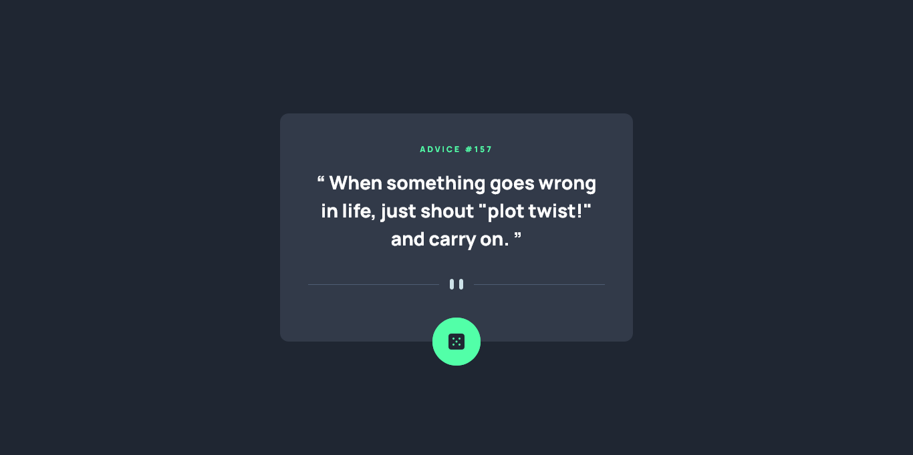

# Frontend Mentor - Advice generator app solution

This is a solution to the [Advice generator app challenge on Frontend Mentor](https://www.frontendmentor.io/challenges/advice-generator-app-QdUG-13db). Frontend Mentor challenges help you improve your coding skills by building realistic projects.

## Table of contents

- [Overview](#overview)
  - [The challenge](#the-challenge)
  - [Screenshot](#screenshot)
  - [Links](#links)
- [My process](#my-process)
  - [Built with](#built-with)
  - [Useful resources](#useful-resources)
- [Author](#author)

## Overview

### The challenge

Users should be able to:

- View the optimal layout for the app depending on their device's screen size
- See hover states for all interactive elements on the page
- Generate a new piece of advice by clicking the dice icon

### Screenshot

### Links

- Solution URL: [Source code](https://github.com/arey-dev/advice-generator-app)
- Live Site URL: [Github Page](https://arey-dev.github.io/advice-generator-app/)

## My process

### Built with

- CSS
- [React](https://reactjs.org/) - JS library

### Useful resources

- [reactjs.org](https://reactjs.org/docs/) - I made this app with react, so the official docs for react was really helpful
- [The Odin Project](https://www.theodinproject.com/) - The resources provided in this curriculum are really helpful.

## Author

- Frontend Mentor - [@arey-dev](https://www.frontendmentor.io/profile/arey-dev)
- Github - [arey-dev](https://github.com/arey-dev)
